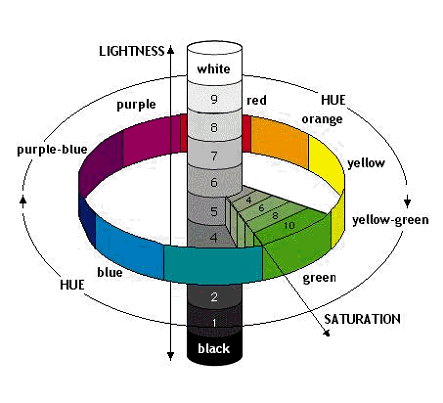
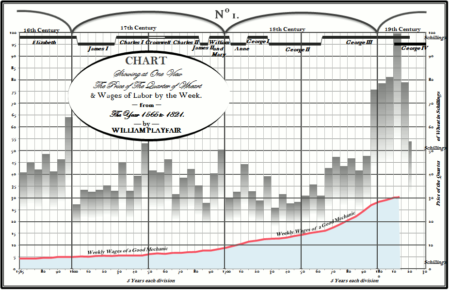
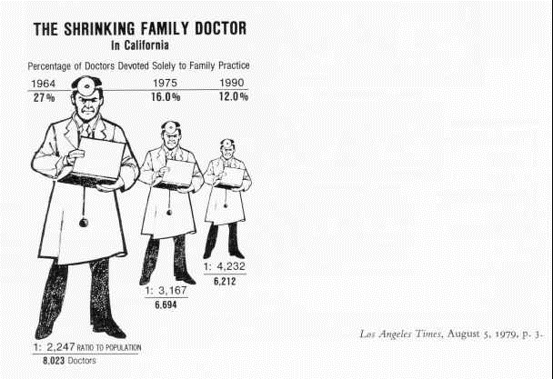
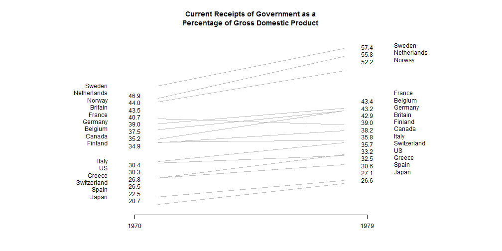

<div class="hero-banner">
<div class="week-badge">2</div>
<h1>Visual Perception & Design Principles</h1>
<p>How the brain processes visual information and how great designers have turned that knowledge into lasting principles</p>
</div>

::: {.objectives}
## Learning Objectives

By the end of this week, you will be able to:

- Explain the two stages of visual processing (preattentive and attentive) and their design implications
- Identify and leverage preattentive attributes in visualization design
- Apply Gestalt principles of perception to organize visual elements
- Use Cleveland & McGill's perceptual hierarchy to choose appropriate chart types
- Select effective color palettes for sequential, diverging, and qualitative data
- Design visualizations that account for colorblindness and working memory limits
- Explain and apply Tufte's data-ink ratio and lie factor concepts
- Identify common deceptive practices in data visualization and explain why they mislead
- Redesign a cluttered chart to maximize the data-ink ratio using ggplot2
:::

::: {.callout-error}
## Common Errors You May Encounter

**"Error: could not find function 'display.brewer.pal'"**
This means the RColorBrewer package is not loaded. Add `library(RColorBrewer)` at the top of your script or chunk.

**"Error in library(patchwork) : there is no package called 'patchwork'"**
You need to install the package first. Run `install.packages("patchwork")` in the console (not inside a code chunk), then try `library(patchwork)` again.

**Plots look squished or overlapping**
Try adjusting `fig.width` and `fig.height` in your chunk options. For side-by-side plots using patchwork, `fig.width=10, fig.height=5` is a good starting point. Example: ```` ```{r my-plot, fig.width=10, fig.height=5} ````

**Colors look wrong or produce an error**
Make sure you are using quotes around hex color codes: `"#002967"` not `#002967`. Without quotes, R interprets the `#` as a comment and ignores the rest.
:::

---

## Part 1: How the Brain Sees Data

Of all our senses, **vision has by far the highest bandwidth**. We take in more information through our eyes than through hearing, touch, taste, and smell combined. This is why visualization is such a powerful tool for understanding data -- it leverages the sense we are best equipped to use.

```{r sensory-bandwidth, echo=FALSE, fig.cap="Vision dominates our sensory bandwidth, making it the most effective channel for communicating complex data.", out.width="70%"}
knitr::include_graphics("images/02/sensory_bandwidths.jpg")
```

But vision is not a simple camera. The brain processes visual information in **two distinct stages**:

1. **Preattentive processing** -- fast, parallel, and automatic. This happens in under 250 milliseconds, before you are consciously aware of it. Your visual system detects certain features (color, size, orientation, motion) across the entire visual field simultaneously.
2. **Attentive processing** -- slow, serial, and effortful. This is the deliberate, conscious examination of individual elements one at a time. It requires focused attention and cognitive effort.

The distinction matters enormously for visualization design. If you encode important information using preattentive attributes, your viewer will grasp it instantly. If you require attentive processing for the key message, your viewer must work hard -- and may miss it entirely.

```{r preattentive-example, echo=FALSE, fig.cap="Preattentive processing allows us to detect certain visual features instantly, without conscious effort.", out.width="70%"}
knitr::include_graphics("images/02/preattentive.png")
```

Here is a classic demonstration. In the first image below, the number 5 is hidden among other digits in uniform grey. In the second, the 5s are highlighted in a contrasting color. Notice how effortlessly you detect them once color provides a preattentive cue.

```{r num5-grey, echo=FALSE, fig.cap="Without a preattentive cue, finding the 5s requires slow, serial search.", out.width="45%"}
knitr::include_graphics("images/02/num5grey.jpg")
```

```{r num5-highlight, echo=FALSE, fig.cap="With color as a preattentive cue, the 5s pop out immediately.", out.width="45%"}
knitr::include_graphics("images/02/num5greyblack.jpg")
```

## Preattentive Attributes

Researchers have identified a set of visual properties that our brains process preattentively. These include:

- **Position** -- where something is located in space
- **Length** -- the extent of a line or bar
- **Size** -- the area of a mark
- **Shape** -- circles vs. squares vs. triangles, etc.
- **Color (hue)** -- red vs. blue vs. green
- **Color (intensity/saturation)** -- light vs. dark
- **Orientation** -- the angle or tilt of a mark
- **Enclosure** -- bounded regions

```{r preattentive-attributes, echo=FALSE, fig.cap="A visual catalog of preattentive attributes. Each of these features is detected automatically by the visual system.", out.width="80%"}
knitr::include_graphics("images/02/Preattentive_3.JPG")
```

All of these are processed in **under 250 milliseconds** -- before conscious attention kicks in. This is why a single red dot among grey dots "pops out" instantly, but finding a specific letter in a block of text requires careful scanning.

::: {.callout-tip}
**Design implication:** When you want to draw attention to a specific data point or category, encode it with a preattentive attribute -- a distinct color, a larger size, or a different shape. Do not rely on labels or legends alone for the most important comparisons.
:::

## Try It: Preattentive Processing Explorer

You have just read about preattentive attributes in theory. Now experience them firsthand. The sandbox below lets you switch between color, size, and shape cues, adjust the number of distractor points, and see how well each attribute "pops out" under different conditions.

<div class="sandbox-section">
<div class="sandbox-header">
<span class="sandbox-icon">🧪</span> Preattentive Processing Explorer — Which Attribute Pops Out?
</div>
<iframe class="sandbox-frame" src="https://analytics.gonzaga.edu/content/b52f3a3d-3ee1-4191-9f7f-ba83cea3347d/"
        height="580" loading="lazy" allowfullscreen></iframe>
<div class="sandbox-cold-start">
If the app takes a few seconds to load on first visit, that is normal — the server is waking up.
</div>
</div>

::: {.try-it-box}
**Exploration Tasks:**

1. Set the attribute to **Color** and increase the number of background points to 100. How quickly can you spot the target?
2. Switch to **Shape** with the same number of points. Is the target harder or easier to find compared to color?
3. Try **Size** — does a larger target pop out as effectively as a differently colored one?
4. Enable **Redundant coding** (color + size together). Does the combination make the target even more noticeable? Why might this matter for accessibility?
:::

::: {.callout-info}
**What You Should Have Noticed:** Color is typically the strongest preattentive cue — the target pops out almost instantly regardless of how many distractors surround it. Shape is weaker, especially with many points. Size is moderate. Redundant coding (combining two channels) is the most robust, which is why it is recommended for colorblind-accessible designs.
:::

::: {.callout-ai}
**AI & This Concept**
When prompting AI to build a chart, don't let it choose the encoding by default. Specify *which* preattentive attribute you want to use and *why*. AI tools tend to over-rely on color — use this sandbox to decide for yourself which attribute works best for your data.
:::

### Preattentive Processing in R: Color Cue

Let us demonstrate this principle step by step. First, we create a scatter plot where all points look the same:

```{r preattentive-setup, message=FALSE, warning=FALSE}
library(tidyverse)
library(patchwork)

set.seed(42)
df_points <- tibble(
  x = runif(50),
  y = runif(50),
  group = c(rep("background", 49), "target")
)
```

Now we plot two versions -- one with no cue, one with color:

```{r preattentive-color-demo, fig.width=8, fig.height=4}
p_no_cue <- ggplot(df_points, aes(x, y)) +
  geom_point(size = 4, color = "#94a3b8") +
  labs(title = "No preattentive cue",
       subtitle = "Find the different point") +
  theme_minimal(base_size = 13)

p_color_cue <- ggplot(df_points, aes(x, y, color = group)) +
  geom_point(size = 4) +
  scale_color_manual(values = c("background" = "#94a3b8", "target" = "#C41E3A")) +
  labs(title = "Color as preattentive cue",
       subtitle = "The target pops out instantly") +
  theme_minimal(base_size = 13) +
  theme(legend.position = "none")

p_no_cue + p_color_cue
```

In the left panel, every point is identical -- finding the "target" is impossible without additional information. In the right panel, the single red point (Gonzaga red, `#C41E3A`) is detected immediately. This is preattentive processing at work.

### Preattentive Processing in R: Size and Redundant Coding

We can extend this demonstration to show how **size** also serves as a preattentive cue, and how combining cues (redundant coding) is even more effective:

```{r preattentive-size-demo, fig.width=8, fig.height=4}
p_size_cue <- ggplot(df_points, aes(x, y, size = group)) +
  geom_point(color = "#002967") +
  scale_size_manual(values = c("background" = 3, "target" = 8)) +
  labs(title = "Size as preattentive cue",
       subtitle = "Larger size draws immediate attention") +
  theme_minimal(base_size = 13) +
  theme(legend.position = "none")

p_redundant <- ggplot(df_points, aes(x, y, color = group, size = group)) +
  geom_point() +
  scale_color_manual(values = c("background" = "#94a3b8", "target" = "#C41E3A")) +
  scale_size_manual(values = c("background" = 3, "target" = 8)) +
  labs(title = "Color + size (redundant coding)",
       subtitle = "Multiple cues reinforce each other") +
  theme_minimal(base_size = 13) +
  theme(legend.position = "none")

p_size_cue + p_redundant
```

Notice how combining color and size -- **redundant coding** -- makes the target even more salient. This is a valuable technique when you need to ensure a data point is noticed.

## Gestalt Principles of Perception

In the early 20th century, German psychologists developed the **Gestalt principles** -- a set of rules describing how the brain organizes visual elements into coherent groups. These principles operate automatically and have direct implications for chart design.

```{r gestalt-image, echo=FALSE, fig.cap="The Gestalt principles describe how we perceive groups, patterns, and wholes from individual visual elements.", out.width="80%"}
knitr::include_graphics("images/02/gestaltcomplete6.png")
```

The key Gestalt principles for visualization are:

- **Proximity** -- Elements that are close together are perceived as belonging to the same group. In a grouped bar chart, the bars within each cluster are read as related because they are near one another.
- **Similarity** -- Elements that look alike (same color, shape, or size) are perceived as related. This is why we use consistent colors for the same category across multiple panels.
- **Enclosure** -- A boundary or shaded region around elements groups them together, even if they are otherwise dissimilar. This is the principle behind panel borders in faceted plots.
- **Closure** -- The brain completes incomplete shapes. We perceive a circle even when part of its outline is missing. Grid lines do not need to be continuous -- subtle tick marks are often sufficient.
- **Continuity** -- Elements arranged along a smooth line or curve are perceived as more related. This is why connected line charts are so effective for showing trends over time.
- **Connection** -- Elements that are physically connected (by a line, for example) are perceived as related. This principle is stronger than color similarity.

::: {.callout-tip}
**Putting Gestalt to work:** When designing a visualization, ask yourself: "What groupings do I want the viewer to perceive?" Then use proximity, similarity, enclosure, or connection to create those groupings. If the viewer is seeing groups you did not intend, one of these principles is likely working against you.
:::

### Gestalt in Practice with ggplot2

Let us see how proximity and similarity work in a real chart. We will use the `mpg` dataset to create a grouped bar chart where Gestalt principles organize the visual information:

```{r gestalt-demo, fig.width=9, fig.height=5, message=FALSE}
mpg_summary <- mpg %>%
  filter(class %in% c("compact", "midsize", "suv")) %>%
  group_by(class, drv) %>%
  summarise(mean_hwy = mean(hwy), .groups = "drop")

ggplot(mpg_summary, aes(x = class, y = mean_hwy, fill = drv)) +
  geom_col(position = position_dodge(width = 0.8), width = 0.7) +
  scale_fill_manual(
    values = c("4" = "#002967", "f" = "#C41E3A", "r" = "#B4975A"),
    labels = c("4" = "4-Wheel", "f" = "Front", "r" = "Rear")
  ) +
  labs(title = "Gestalt Principles at Work",
       subtitle = "Proximity groups bars by class; similarity (color) groups by drive type",
       x = "Vehicle Class", y = "Mean Highway MPG", fill = "Drive Type") +
  theme_minimal(base_size = 13)
```

In this chart, **proximity** groups the bars within each vehicle class (compact, midsize, SUV), while **similarity** (color) lets you compare drive types across classes. The Gonzaga colors -- navy (`#002967`), red (`#C41E3A`), and gold (`#B4975A`) -- provide distinct, memorable hues.

## Cleveland & McGill's Perceptual Hierarchy

Not all visual encodings are created equal. In a landmark 1984 paper, William Cleveland and Robert McGill conducted experiments to determine which visual properties people judge most accurately. Their findings established a **perceptual hierarchy** that remains foundational to visualization design.

```{r cleveland-mcgill, echo=FALSE, fig.cap="Cleveland and McGill's hierarchy of perceptual accuracy, as adapted by Alberto Cairo. Encodings at the top are judged most accurately.", out.width="70%"}
knitr::include_graphics("images/02/cleveland_mcgill_cairo.jpg")
```

From **most accurate** to **least accurate**:

1. **Position on a common scale** -- comparing points along a shared axis (e.g., dot plot, scatter plot)
2. **Position on unaligned scales** -- comparing across separate but similar axes (e.g., small multiples)
3. **Length** -- comparing the extent of bars or lines (e.g., bar chart)
4. **Angle / Slope** -- judging tilt or wedge size (e.g., pie chart, slope graph)
5. **Area** -- comparing the size of regions (e.g., bubble chart, treemap)
6. **Volume** -- comparing 3D objects (generally poor; avoid 3D charts)
7. **Color saturation / Density** -- comparing shading intensity (e.g., heatmap, choropleth)

This hierarchy explains many best practices:

- **Bar charts beat pie charts** because length (rank 3) is judged far more accurately than angle (rank 4).
- **Scatter plots are excellent** because they encode data as position on common scales (rank 1).
- **3D charts are almost never appropriate** because volume (rank 6) is the second-least accurate encoding.

```{r bar-bubble-heatmap, echo=FALSE, fig.cap="The same data shown as a bar chart, bubble chart, and heatmap. Notice how precision decreases from left to right.", out.width="80%"}
knitr::include_graphics("images/02/barbubbleheatmap.jpg")
```

### Demonstrating the Hierarchy in R

Let us compare a bar chart and a pie chart showing the same data -- vehicle class distribution in the `mpg` dataset:

```{r hierarchy-demo, fig.width=10, fig.height=5, message=FALSE}
class_counts <- mpg %>%
  count(class) %>%
  mutate(class = fct_reorder(class, n))

p_bar <- ggplot(class_counts, aes(x = class, y = n)) +
  geom_col(fill = "#002967", width = 0.7) +
  geom_text(aes(label = n), hjust = -0.2, size = 3.5, color = "#333333") +
  coord_flip() +
  labs(title = "Bar Chart (length encoding)",
       subtitle = "Easy to compare precise values",
       x = NULL, y = "Count") +
  theme_minimal(base_size = 13) +
  expand_limits(y = max(class_counts$n) * 1.1)

p_pie <- ggplot(class_counts, aes(x = "", y = n, fill = class)) +
  geom_col(width = 1) +
  coord_polar(theta = "y") +
  scale_fill_brewer(palette = "Set2") +
  labs(title = "Pie Chart (angle encoding)",
       subtitle = "Hard to compare similar slices",
       fill = "Class") +
  theme_void(base_size = 13)

p_bar + p_pie
```

Which chart makes it easier to compare the number of compact vs. midsize vehicles? The bar chart wins decisively because **length** (rank 3) is far more accurately perceived than **angle** (rank 4).

## Color Theory for Visualization

Color is one of the most powerful and most misused tools in data visualization. To use it effectively, we need to understand its three components.

```{r munsell-hsl, echo=FALSE, fig.cap="Color can be described by three properties: hue, saturation, and lightness.", out.width="60%"}

```

- **Hue** -- what we colloquially call "color": red, blue, green, orange, etc.
- **Saturation** (chroma) -- the intensity or purity of the color, from vivid to muted grey
- **Lightness** (value) -- how light or dark the color is, from white to black

Different types of data call for different types of color palettes:

**Sequential palettes:** A single hue that varies in lightness. Use for ordered, continuous data (e.g., temperature, population density). Light = low values; dark = high values.

**Diverging palettes:** Two contrasting hues with a neutral midpoint. Use for data with a meaningful center (e.g., deviations from average, profit/loss).

**Qualitative palettes:** Distinct hues at similar saturation and lightness. Use for categorical data with no natural ordering (e.g., country, department).

```{r color-palettes, fig.width=10, fig.height=4, message=FALSE, warning=FALSE}
library(RColorBrewer)
par(mfrow = c(1, 3), mar = c(1, 1, 3, 1))
display.brewer.pal(7, "Blues")
title("Sequential: Blues", line = 1)
display.brewer.pal(7, "RdYlBu")
title("Diverging: RdYlBu", line = 1)
display.brewer.pal(7, "Set2")
title("Qualitative: Set2", line = 1)
```

### Colorblindness and the Viridis Palette

Approximately **8% of men and 0.5% of women** have some form of color vision deficiency, most commonly red-green colorblindness. Any visualization that relies solely on the difference between red and green will be unreadable for roughly 1 in 12 male viewers.

Practical recommendations:

- Use **colorblind-friendly palettes** such as viridis, which varies in both hue and lightness
- **Avoid red-green contrasts** as the sole distinguishing feature
- Use **redundant coding** -- combine color with shape, pattern, or direct labels
- Test your plots with a colorblind simulator

The `viridis` palettes are specifically designed to be **perceptually uniform**, **colorblind-friendly**, and **readable in greyscale**. They are an excellent default choice.

```{r viridis-demo, fig.width=8, fig.height=5, message=FALSE, warning=FALSE}
library(viridis)

ggplot(faithfuld, aes(waiting, eruptions, fill = density)) +
  geom_tile() +
  scale_fill_viridis_c(option = "magma") +
  labs(title = "Viridis 'magma' palette",
       subtitle = "Perceptually uniform and colorblind-friendly",
       x = "Waiting Time (min)", y = "Eruption Duration (min)") +
  theme_minimal(base_size = 13)
```

```{r context-image, echo=FALSE, fig.cap="Context effects: identical colors appear different depending on their surroundings. This is why consistent backgrounds matter in visualization.", out.width="60%"}
knitr::include_graphics("images/02/context.png")
```

::: {.callout-tip}
**Rule of thumb for color:** Use color purposefully. If a color does not encode data or serve a grouping function, consider whether it is adding unnecessary visual noise. Default to a muted palette and reserve vivid colors for the elements you want to emphasize.
:::

## Working Memory and Direct Labeling

Our visual working memory is remarkably limited. Research shows we can hold approximately **3 to 4 items** in visual working memory at any given time. This has profound consequences for chart design.

```{r memory-gif, echo=FALSE, fig.cap="Visual working memory is limited to about 3-4 items. Exceeding this limit forces viewers to look back and forth between the legend and the chart.", out.width="70%"}
knitr::include_graphics("images/02/memory.gif")
```

If your chart has a legend with 8 categories mapped to 8 colors, the viewer must constantly shuttle between the legend and the data. This is slow, error-prone, and exhausting. Better approaches include:

- **Direct labeling** -- place category labels directly next to or on the data elements
- **Limit categories** -- show only the 3-4 most important groups; collapse the rest into "Other"
- **Use facets** -- create small multiples so color does not carry the full burden
- **Highlight and grey out** -- show all data in muted grey and highlight only 1-2 categories of interest

```{r direct-label-demo, fig.width=9, fig.height=5, message=FALSE, warning=FALSE}
library(ggrepel)

econ_data <- economics_long %>%
  filter(variable %in% c("pop", "unemploy", "uempmed")) %>%
  group_by(variable) %>%
  mutate(value_scaled = (value - min(value)) / (max(value) - min(value))) %>%
  ungroup()

label_data <- econ_data %>%
  group_by(variable) %>%
  filter(date == max(date))

ggplot(econ_data, aes(x = date, y = value_scaled, color = variable)) +
  geom_line(linewidth = 1) +
  geom_text_repel(
    data = label_data,
    aes(label = variable),
    nudge_x = 300, direction = "y", hjust = 0,
    segment.color = "grey70", size = 4
  ) +
  scale_color_manual(values = c("pop" = "#002967", "unemploy" = "#C41E3A", "uempmed" = "#B4975A")) +
  labs(title = "Direct Labeling Reduces Cognitive Load",
       subtitle = "Labels on the lines eliminate the need to look up a legend",
       x = NULL, y = "Scaled Value (0-1)") +
  theme_minimal(base_size = 13) +
  theme(legend.position = "none") +
  coord_cartesian(clip = "off") +
  theme(plot.margin = margin(5, 40, 5, 5))
```

By placing labels directly on the lines, the viewer never needs to consult a legend. This is faster, less effortful, and reduces the demands on visual working memory.

---

## Part 2: Design Principles and the History of Great Charts

Now that we understand how the brain processes visual information, let us turn to the design principles that great visualization practitioners have developed over the past two centuries. These principles translate perceptual science into practical guidelines.

## Landmarks in Visualization History

The craft of data visualization has deep roots. Three landmark examples illustrate why design principles matter -- and why some of the best advice is over two centuries old.

**William Playfair (1786)** invented the bar chart, line chart, and pie chart in his book *The Commercial and Political Atlas*. At a time when tables of numbers were the norm, Playfair's insight was radical: a well-drawn picture could convey trends and comparisons far more quickly than rows of figures. Even by modern standards, his charts are readable and elegant.

```{r playfair, echo=FALSE, fig.cap="William Playfair's time series and bar chart from The Commercial and Political Atlas (1786) -- the earliest known examples of these chart forms.", out.width="80%"}

```

**John Snow (1854)** challenged the prevailing "bad air" theory of cholera by plotting deaths on a map of London's Soho district. The resulting visualization -- one of the most famous in the history of science -- revealed a striking cluster of deaths around the Broad Street water pump, pointing to contaminated water as the source. The pump handle was removed, and the outbreak subsided. This is visualization as a tool for saving lives.

```{r snow-map, echo=FALSE, fig.cap="John Snow's cholera map of the Soho district, London (1854). Each small bar represents a death. The cluster around the Broad Street pump is unmistakable.", out.width="70%"}
knitr::include_graphics("images/03/snow-cholera.gif")
```

**Charles Joseph Minard (1869)** created what Edward Tufte called "the best statistical graphic ever drawn." His depiction of Napoleon's 1812 Russian campaign encodes six variables in a single image: the size of the army, its location (latitude and longitude), direction of movement, temperature during the retreat, and dates of key events. The shrinking band tells the story of catastrophic loss more powerfully than any table of casualty figures could.

```{r minard, echo=FALSE, fig.cap="Minard's map of Napoleon's march to and from Moscow (1869). The width of the band represents army size -- from 422,000 soldiers at the start to a mere 10,000 returning.", out.width="100%"}
knitr::include_graphics("images/03/Minardfrench.png")
```

The thread connecting Playfair, Snow, and Minard to modern practitioners is a commitment to **honesty, clarity, and efficiency** in visual communication. These are the design principles we now turn to.

## Tufte's Data-Ink Ratio

Edward Tufte is arguably the most influential thinker in data visualization design. His core concept is the **data-ink ratio**:

$$\text{Data-ink ratio} = \frac{\text{Data-ink}}{\text{Total ink used in the graphic}}$$

The principle is simple: **maximize the share of ink (or pixels) devoted to displaying actual data**. Everything else -- unnecessary gridlines, heavy borders, decorative shading, redundant labels, 3D effects -- is "non-data-ink" that should be eliminated or minimized. Tufte calls excessive non-data-ink **chartjunk**.

This does not mean charts should be ugly or austere. It means every visual element should earn its place by communicating something useful. If an element can be removed without losing information, it probably should be.

### Data-Ink Demo: Setting Up the Data

Let us see this in practice step by step. First we create a simple dataset:

```{r data-ink-setup, message=FALSE, warning=FALSE}
library(tidyverse)
library(patchwork)

df_budget <- tibble(
  category = c("Product A", "Product B", "Product C", "Product D", "Product E"),
  value = c(45, 72, 38, 61, 53)
)
```

### Data-Ink Demo: The Cluttered Version

Now we create a bar chart heavy with chartjunk -- unnecessary gridlines, a filled background, and no direct labels:

```{r data-ink-before, fig.width=5, fig.height=4}
p_cluttered <- ggplot(df_budget, aes(x = category, y = value)) +
  geom_bar(stat = "identity", fill = "#002967", width = 0.5) +
  theme_gray(base_size = 13) +
  theme(panel.grid.major.x = element_line(),
        panel.grid.minor = element_line()) +
  labs(title = "Before: Low data-ink ratio",
       x = "Category", y = "Value")

p_cluttered
```

### Data-Ink Demo: The Clean Version

Now we strip away the chartjunk and add direct labels. Compare the two:

```{r data-ink-after, fig.width=10, fig.height=4}
p_clean <- ggplot(df_budget, aes(x = category, y = value)) +
  geom_bar(stat = "identity", fill = "#002967", width = 0.5) +
  geom_text(aes(label = value), vjust = -0.5, size = 4, color = "#002967") +
  theme_minimal(base_size = 13) +
  theme(panel.grid.major.x = element_blank(),
        panel.grid.minor = element_blank(),
        axis.title = element_blank()) +
  labs(title = "After: High data-ink ratio")

p_cluttered + p_clean
```

The "after" version communicates the same data more effectively. The gridlines are gone because the direct labels make them unnecessary. The axis title is removed because the category labels are self-explanatory. Every remaining element serves a purpose.

::: {.callout-tip}
**Practical rule of thumb:** After creating a chart, ask yourself: "Can I remove this element without losing information?" If the answer is yes, remove it. Repeat until the answer is no for every remaining element.
:::

## The Lie Factor

The **lie factor** measures the degree to which a graphic distorts the underlying data:

$$\text{Lie factor} = \frac{\text{Size of effect shown in the graphic}}{\text{Size of effect in the data}}$$

A lie factor of 1.0 means the graphic faithfully represents the data. Tufte argues that lie factors above 1.05 or below 0.95 represent significant distortions.

### Distorted Proportions

When graphical representations of quantities use area or volume rather than length, distortion often follows:

```{r shrinking-doctor, echo=FALSE, fig.cap="The 'shrinking doctor' -- the figure shrinks faster than the underlying data warrants, dramatically exaggerating the decline.", out.width="60%"}

```

```{r shrinking-dollar, echo=FALSE, fig.cap="The 'shrinking dollar' -- the visual shrinkage far exceeds the actual decline in purchasing power, producing a lie factor well above 1.", out.width="60%"}
knitr::include_graphics("images/03/lieshrinkingdollar.png")
```

### Truncated Axes

One of the most common forms of deception is truncating the y-axis of a bar chart. Because bars encode quantity through their **length** (from zero to the data value), starting the axis at a non-zero value can make small differences appear enormous.

Let us see this with R code. First, the data:

```{r truncated-data}
df_sales <- tibble(
  quarter = c("Q1", "Q2", "Q3", "Q4"),
  revenue = c(98, 101, 103, 105)
)
```

Now the side-by-side comparison:

```{r truncated-axis-demo, fig.width=10, fig.height=4}
p_misleading <- ggplot(df_sales, aes(x = quarter, y = revenue)) +
  geom_col(fill = "#C41E3A") +
  coord_cartesian(ylim = c(96, 106)) +
  labs(title = "Misleading: Truncated axis",
       subtitle = "Looks like revenue tripled!",
       y = "Revenue ($M)") +
  theme_minimal(base_size = 13)

p_honest <- ggplot(df_sales, aes(x = quarter, y = revenue)) +
  geom_col(fill = "#002967") +
  coord_cartesian(ylim = c(0, 110)) +
  labs(title = "Honest: Full axis",
       subtitle = "Revenue grew modestly (~7%)",
       y = "Revenue ($M)") +
  theme_minimal(base_size = 13)

p_misleading + p_honest
```

The left panel makes it look like revenue tripled from Q1 to Q4. The right panel reveals the truth: revenue grew by about 7%. Same data, radically different impressions.

::: {.callout-warning}
**Important nuance:** Truncated axes are not *always* deceptive. For line charts showing change over time, a non-zero baseline can be appropriate because the visual encoding is position/slope, not length. The rule is: **bar charts must start at zero; line charts can sometimes justify a non-zero baseline** -- but always label your axes clearly.
:::

```{r highway-lie, echo=FALSE, fig.cap="Lie factor in a highway fuel standards graphic. The visual impression exaggerates the actual data change.", out.width="60%"}
knitr::include_graphics("images/03/liefactorhighway.png")
```

## Slopegraphs

A **slopegraph** is a chart designed to show change between two (or occasionally more) time points for multiple categories. It consists of two vertical axes connected by lines, where the slope and direction of each line immediately convey whether a category increased, decreased, or remained stable.

```{r slopegraph-image, echo=FALSE, fig.cap="A slopegraph showing change across two time periods. The slope of each line immediately communicates the direction and magnitude of change.", out.width="60%"}

```

Slopegraphs are a beautifully minimalist design. They use direct labeling (no legend needed), and the visual encoding -- slope -- is one of the most intuitive for the human eye. They are especially effective for:

- Comparing rankings across two time points
- Showing which categories improved and which declined
- Highlighting the magnitude of change through the steepness of the line

## Designing for Clarity

Beyond Tufte's specific principles, several broader guidelines help produce clear, effective visualizations:

**Label directly.** Whenever possible, label data elements directly on the chart rather than relying on a separate legend. Legends force the viewer to look back and forth between the plot and the key, increasing cognitive load.

**Use color purposefully.** Color should encode meaning, not serve as decoration. Reserve color for distinguishing groups, highlighting a key finding, or encoding a variable. Avoid "rainbow" color schemes that have no natural ordering.

**Order data meaningfully.** Default alphabetical ordering is rarely the best choice. Order bars by value. Order time series chronologically. **The order of data in a chart is a design decision**, and it should serve the viewer's understanding.

**Reduce cognitive load.** Every unnecessary element adds to the viewer's cognitive burden. Gridlines, borders, background shading, tick marks, redundant axis labels -- each demands a small amount of attention. Individually they are trivial, but collectively they can obscure the data.

```{r gelman-map, echo=FALSE, fig.cap="Andrew Gelman's redesigned voucher map -- a clear example of thoughtful design choices serving the data.", out.width="70%"}
knitr::include_graphics("images/03/gelmanvouchermap.png")
```

---

::: {.callout-ignatian}
**Ignatian Reflection: Seeing Clearly and Designing Honestly**

The Ignatian tradition places great emphasis on **discernment** -- the practice of perceiving reality as it truly is, free from distortion and self-deception. This week's material reveals how easily our perception can be manipulated. A 3D pie chart exploits our poor ability to judge volume. A rainbow color scale obscures the true magnitude of differences. A truncated axis exaggerates a modest change into a dramatic one.

At Gonzaga, we are guided by the Ignatian principle of *magis* -- the relentless pursuit of the greater good, of doing things not just adequately but with excellence and integrity. In data visualization, magis means stripping away the unnecessary so that truth can emerge clearly. It means choosing honest scales, faithful representations, and designs that serve the viewer rather than the designer's agenda.

The principle of **Cura Personalis** (care for the whole person) calls us to consider our audience's needs: Can a colorblind viewer read this chart? Does this encoding accurately represent the underlying data? Am I making the truth easier to see, or harder?

A lie factor greater than 1 is, in a very real sense, a lie told with data. As you develop your visualization skills, commit to a simple standard: **let the data speak truthfully, and design your charts to amplify that truth, not distort it.**
:::

---

## Summary: A Perception and Design Checklist

When designing or evaluating a visualization, run through this checklist:

| Principle | Question to Ask |
|---|---|
| **Preattentive attributes** | Does the most important information pop out immediately? |
| **Gestalt grouping** | Are visual groups aligned with data groups? |
| **Cleveland & McGill** | Am I using the most accurate encoding for the key comparison? |
| **Color palette** | Is my palette appropriate for the data type (sequential, diverging, qualitative)? |
| **Colorblindness** | Would a colorblind viewer get the same message? |
| **Working memory** | Can the viewer understand the chart without constantly consulting a legend? |
| **Data-ink ratio** | Can I remove any element without losing information? |
| **Lie factor** | Does the visual impression match the magnitude of the data? |
| **Axis integrity** | Do bar charts start at zero? Are scales labeled clearly? |

---

## Exercises

::: {.exercise-block}
::: {.exercise-header}
Week 2 Exercises
:::
::: {.exercise-body}

**Exercise 1: Preattentive Attributes and the Perceptual Hierarchy**

Using the `diamonds` dataset, create two charts of the distribution of diamond `cut` quality -- a bar chart and a pie chart. Fill in the blanks in the code below, then write 2-3 sentences comparing which chart makes it easier to compare categories and why, referencing Cleveland & McGill's hierarchy.

```{r exercise1-template, eval=FALSE}
library(tidyverse)
library(patchwork)

cut_counts <- diamonds %>% count(cut)

# Bar chart -- fill in the missing aesthetic and geom
p_bar <- ggplot(cut_counts, aes(x = fct_reorder(cut, n), y = ___)) +
  geom_col(fill = "#002967") +
  coord_flip() +
  labs(title = "Bar Chart: Diamond Cut Quality",
       x = NULL, y = "Count") +
  theme_minimal(base_size = 13)

# Pie chart -- fill in the missing coord function
p_pie <- ggplot(cut_counts, aes(x = "", y = n, fill = cut)) +
  geom_col(width = 1) +
  ___(theta = "y") +
  scale_fill_brewer(palette = "Set2") +
  labs(title = "Pie Chart: Diamond Cut Quality", fill = "Cut") +
  theme_void(base_size = 13)

p_bar + p_pie
```

**Exercise 2: Colorblind-Friendly Redesign**

The plot below uses a red-green color scheme that is not accessible to colorblind viewers. Fill in the blanks to redesign it using the viridis palette and redundant shape coding.

```{r exercise2-template, eval=FALSE}
library(tidyverse)

# Original: NOT colorblind-friendly
ggplot(mpg, aes(x = displ, y = hwy, color = drv)) +
  geom_point(size = 3) +
  scale_color_manual(values = c("4" = "red", "f" = "green", "r" = "blue")) +
  labs(title = "Original: Poor color choice",
       x = "Engine Displacement (L)", y = "Highway MPG", color = "Drive") +
  theme_minimal()

# Redesign: fill in the blanks for colorblind-friendly version
ggplot(mpg, aes(x = displ, y = hwy, color = drv, shape = ___)) +
  geom_point(size = 3) +
  scale_color_viridis_d(option = "___") +
  labs(title = "Redesign: Colorblind-Friendly with Redundant Coding",
       x = "Engine Displacement (L)", y = "Highway MPG",
       color = "Drive", shape = "Drive") +
  theme_minimal()
```

After creating your redesign, test it using the [Coblis colorblind simulator](https://www.color-blindness.com/coblis-color-blindness-simulator/) by uploading a screenshot of your plot. Write 1-2 sentences about what you observe.

**Exercise 3: Data-Ink Ratio Makeover**

The following code produces a chart overloaded with chartjunk. Fill in the blanks in the redesigned version to maximize the data-ink ratio while keeping the chart readable.

```{r exercise3-template, eval=FALSE}
library(tidyverse)
library(patchwork)

df_dept <- tibble(
  department = c("Marketing", "Engineering", "Sales", "HR", "Finance"),
  budget = c(320, 580, 410, 190, 275)
)

# Original: full of chartjunk
p_junk <- ggplot(df_dept, aes(x = department, y = budget, fill = department)) +
  geom_bar(stat = "identity", color = "black", linewidth = 1.5) +
  theme_dark() +
  theme(panel.grid = element_line(color = "white", linewidth = 0.8),
        legend.position = "right") +
  labs(title = "Before: Department Budgets",
       x = "Department", y = "Budget (thousands $)", fill = "Department")

# Redesign: fill in the blanks to clean it up
p_tufte <- ggplot(df_dept, aes(x = fct_reorder(department, budget), y = budget)) +
  geom_col(fill = "___", width = 0.6) +
  geom_text(aes(label = budget), hjust = -0.2, size = 4, color = "#002967") +
  coord_flip() +
  theme_minimal(base_size = 13) +
  theme(panel.grid.major.___ = element_blank(),
        panel.grid.minor = element_blank(),
        axis.title = ___()) +
  labs(title = "After: Department Budgets")

p_junk + p_tufte
```

Write a brief paragraph explaining what you changed and why each change improves the data-ink ratio.

**Exercise 4: Deceptive Graph Analysis**

Find a deceptive or misleading graph published in a real-world source (news article, social media, corporate report, or political campaign material). Include the image or a link in your R Markdown document. Then answer the following:

- What is the chart trying to communicate?
- What deceptive technique(s) does it use? (truncated axis, area distortion, cherry-picked timeframe, etc.)
- Estimate the lie factor if applicable. Show your calculation.
- Sketch or code in R how you would redesign the chart to be honest.

A good place to find examples is the [WTF Visualizations](https://viz.wtf/) archive.

**Exercise 5: Reading Assignment**

Read the following and write three key takeaways from each in your R Markdown document:

- Wilke, C.O. -- *Fundamentals of Data Visualization*, Chapters 1-2
- Healy, K. -- *Data Visualization: A Practical Introduction*, Chapter 1

Focus on: What principles from this week do the authors emphasize? Where do they offer different perspectives? How do Tufte's ideas about data-ink relate to what Wilke and Healy recommend?

:::
:::

---

## Attributions

::: {.callout-info}
This course material draws on and is inspired by the work of many scholars and practitioners:

- **Vivek H. Patil** -- foundational course design and materials for data visualization at Gonzaga University
- **Cleveland, W.S. & McGill, R.** (1984). "Graphical Perception: Theory, Experimentation, and Application to the Development of Graphical Methods." *Journal of the American Statistical Association*, 79(387), 531--554.
- **Tufte, E.R.** -- *The Visual Display of Quantitative Information* (Graphics Press, 1983, 2001)
- **Playfair, W.** -- *The Commercial and Political Atlas* (1786)
- **Snow, J.** -- *On the Mode of Communication of Cholera* (1855)
- **Minard, C.J.** -- *Carte figurative des pertes successives en hommes de l'Armee Francaise dans la campagne de Russie 1812-1813* (1869)
- **Ware, C.** -- *Information Visualization: Perception for Design* (Morgan Kaufmann)
- **Few, S.** -- Perceptual Edge research and publications on dashboard and visualization design
- **Cairo, A.** -- *The Truthful Art* and *The Functional Art*
- **Wilke, C.O.** -- *Fundamentals of Data Visualization* (O'Reilly, 2019)
- **Healy, K.** -- *Data Visualization: A Practical Introduction* (Princeton University Press, 2018)
:::

<div class="page-nav">
<a href="week01.html">&larr; Week 1: Introduction</a>
<a href="week03.html">Week 3 &rarr;</a>
</div>
