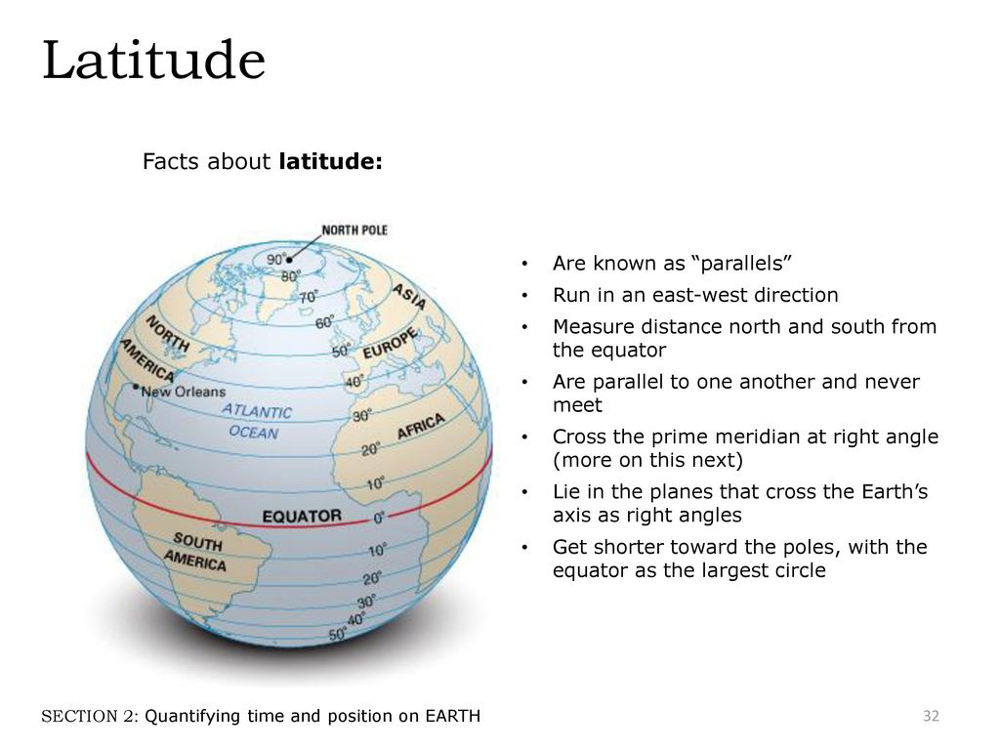
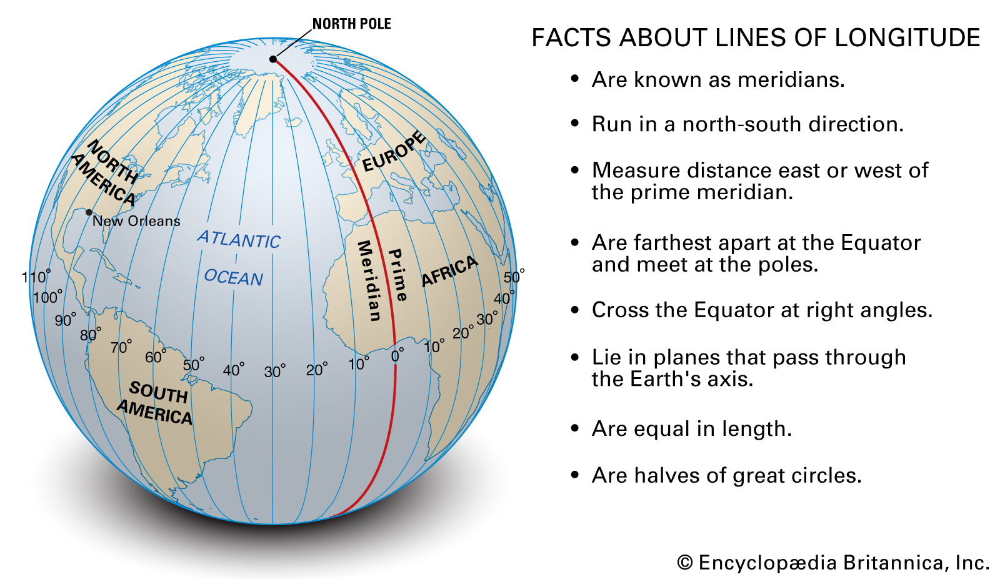

<div class="hero-banner">
<div class="week-badge">7</div>
<h1>Geographic Visualization</h1>
<p>Mapping data in space — from choropleths to interactive Leaflet maps</p>
</div>

::: {.objectives}
## Learning Objectives

By the end of this week, you will be able to:

- Understand geographic coordinate systems (latitude and longitude)
- Create interactive maps with the Leaflet package in R
- Build choropleth maps (filled maps) for U.S. states using ggplot2
- Use the sf package for working with spatial data (conceptual introduction)
- Design effective geographic visualizations that communicate clearly
:::

::: {.callout-info}
**Async note on map data:** All of the map data used in this week's materials comes from built-in R packages (`maps`, `mapproj`) and built-in datasets (`state.x77`, `state.name`, `state.center`). You do not need to download any external shapefiles or GeoJSON files. Pre-built map data is provided so you can focus on the visualization techniques rather than data acquisition. Just make sure you have the required packages installed (see the Common Errors box below).
:::

::: {.callout-error}
**Common Errors You May Encounter This Week**

**Error: `there is no package called 'maps'`**

```
Error in library(maps) : there is no package called 'maps'
```

**Fix:** Run `install.packages(c("maps", "mapproj"))` in your console. These packages provide the `map_data()` function and projection support.

---

**Error: `could not find function "map_data"`**

```
Error in map_data("state") : could not find function 'map_data'
```

**Fix:** Make sure you have loaded the `maps` package with `library(maps)`. The `map_data()` function lives in ggplot2 but requires the `maps` package to be installed and loaded.

---

**Leaflet map appears blank or shows wrong location**

**Fix:** Check that your latitude and longitude values are not swapped. Latitude measures north/south (roughly -90 to 90) and longitude measures east/west (roughly -180 to 180). For Spokane, WA: lat = 47.67 (north), lng = -117.40 (west). If your map shows the middle of the ocean, the values are likely reversed.

---

**Error: `could not find function "coord_map"`**

```
Error in coord_map("albers", lat0 = 39, lat1 = 45) :
  could not find function 'coord_map'
```

**Fix:** The `coord_map()` function requires the `mapproj` package. Run `install.packages("mapproj")` and then `library(mapproj)`.

---

**Choropleth has missing states (gray patches)**

**Fix:** The `map_data("state")` function uses lowercase state names in the `region` column. If your data has state names like `"New York"` or `"NEW YORK"`, the join will fail for those states. Use `tolower()` to convert your state names to lowercase before joining: `mutate(state = tolower(state))`.

---

**Error: `unused argument (lat0 = ...)`**

```
Error in coord_map("albers", lat0 = 39, lat1 = 45) :
  unused argument (lat0 = 39)
```

**Fix:** This means the `mapproj` package is not installed or not loaded. Run `install.packages("mapproj")` and restart your R session, then load it with `library(mapproj)`.
:::

## Why Maps Matter

Maps are one of the oldest and most powerful forms of data visualization. Long before scatterplots or bar charts existed, humans were drawing maps to understand the world around them -- to navigate, to claim territory, to plan cities. What makes maps unique as a visualization tool is that they encode data within a spatial context that viewers already understand. Everyone knows what a map is. Everyone has an intuitive sense of geography. When you overlay data onto a map, you are leveraging that deep spatial intuition to communicate patterns that might be invisible in a table or a standard chart.

The most famous example in the history of data visualization is arguably a map. In 1854, London was in the grip of a devastating cholera outbreak. The prevailing theory was that cholera spread through "miasma" -- bad air. **John Snow**, a physician, was skeptical. He plotted the addresses of cholera deaths on a street map of Soho and discovered that the cases clustered tightly around a single water pump on Broad Street. This geographic visualization was instrumental in identifying contaminated water as the source of the disease. Epidemiology was, in a very real sense, born from a map.

Today, geographic visualization is everywhere:

- **Election maps** show us the political landscape of a country, county by county
- **COVID-19 dashboards** tracked the spread of a pandemic across the globe in real time
- **Climate change maps** visualize rising temperatures, shrinking ice sheets, and shifting precipitation patterns
- **Business analytics** use maps to understand customer distribution, optimize delivery routes, and identify underserved markets

::: {.callout-info}
**Maps are persuasive.** Because they feel familiar and intuitive, maps carry a special persuasive power. This means they can also mislead. A poorly designed map -- with inappropriate color scales, misleading projections, or cherry-picked data -- can distort the viewer's understanding of reality. As with all visualization, honesty and care are essential.
:::

## Geographic Coordinate Systems

Before we can place data on a map, we need to understand how locations on Earth are specified. The system most of us are familiar with is **latitude and longitude** -- a grid of imaginary lines that wrap around the planet.

```{r coord-diagram, echo=FALSE, fig.cap="Latitude and longitude form a coordinate grid that covers the entire Earth. Latitude measures north-south position; longitude measures east-west position.", out.width="70%", message=FALSE, warning=FALSE}
knitr::include_graphics("images/07/latlongcutaway.jpg")
```

### Latitude

**Latitude** measures how far north or south a location is from the equator. The equator is at 0 degrees, the North Pole is at 90 degrees north, and the South Pole is at 90 degrees south. Lines of latitude run east-west and are sometimes called **parallels** because they are parallel to one another.

```{r latitudes-diagram, echo=FALSE, fig.cap="Lines of latitude run east-west, parallel to the equator, measuring north-south position.", out.width="50%", message=FALSE, warning=FALSE}

```

### Longitude

**Longitude** measures how far east or west a location is from the Prime Meridian, which passes through Greenwich, England. The Prime Meridian is at 0 degrees, and longitude ranges from -180 degrees (west) to +180 degrees (east). Lines of longitude run north-south and are called **meridians**. Unlike parallels, meridians converge at the poles.

```{r meridians-diagram, echo=FALSE, fig.cap="Lines of longitude (meridians) run north-south, converging at the poles.", out.width="50%", message=FALSE, warning=FALSE}

```

For example, Gonzaga University in Spokane, Washington, is located at approximately **47.67 degrees north latitude, 117.40 degrees west longitude** -- or in decimal notation, (47.6672, -117.4024). The negative sign on the longitude indicates west of the Prime Meridian.

### Map Projections

Here is a fundamental challenge of cartography: the Earth is a sphere (technically an oblate spheroid), but maps are flat. Transforming a three-dimensional surface into a two-dimensional plane inevitably introduces distortion. The mathematical formulas that perform this transformation are called **projections**, and every projection makes trade-offs.

No projection can preserve all four properties simultaneously:

- **Area** -- the relative sizes of regions
- **Shape** -- the local angles and forms of features
- **Distance** -- the true distances between points
- **Direction** -- the true bearings between points

Some common projections include:

| Projection | Preserves | Distorts | Common Use |
|:-----------|:----------|:---------|:-----------|
| **Mercator** | Shape and direction | Area (polar regions appear enormous) | Navigation, web maps (Google Maps) |
| **Robinson** | Compromise -- nothing perfectly | Less extreme distortion overall | General-purpose world maps |
| **Albers Equal Area** | Area | Shape at the edges | U.S. thematic maps (choropleths) |

::: {.callout-warning}
**The Mercator Problem:** The Mercator projection, which is the default on most web mapping platforms, dramatically inflates the size of regions near the poles. On a Mercator map, Greenland appears to be roughly the same size as Africa. In reality, Africa is about 14 times larger. When creating thematic maps (like choropleths), consider using an equal-area projection so that visual area corresponds to actual area.
:::

## Leaflet -- Interactive Maps

**Leaflet** is one of the most popular open-source JavaScript libraries for interactive maps, and the `leaflet` R package provides an elegant interface to it. Leaflet maps are interactive by default: users can pan, zoom, click on markers, and explore the data directly. This makes them ideal for HTML documents and dashboards.

Let us start with a simple example: placing a marker on the Gonzaga University campus.

```{r week7-setup, message=FALSE, warning=FALSE}
library(tidyverse)
library(leaflet)
library(maps)
library(mapproj)
library(sf)
library(scales)
library(patchwork)
```

```{r leaflet-gonzaga-marker, eval=TRUE, message=FALSE, warning=FALSE}
leaflet() %>%
  setView(lng = -117.4024, lat = 47.6672, zoom = 15) %>%
  addTiles() %>%
  addMarkers(lng = -117.4024, lat = 47.6672,
             popup = "<b>Gonzaga University</b><br>Spokane, WA<br><em>Ad Majorem Dei Gloriam</em>")
```

Let us break down the code:

- `leaflet()` creates a new map widget
- `setView()` centers the map on a specific latitude and longitude at a given zoom level
- `addTiles()` adds the default **tile layer** -- the base map imagery. By default, this is OpenStreetMap
- `addMarkers()` places a clickable marker at the specified coordinates, with an HTML popup

The `%>%` pipe makes this read naturally: create a map, *then* set the view, *then* add tiles, *then* add markers.

### Tile Providers

The visual appearance of a Leaflet map is largely determined by its **tile provider** -- the service that supplies the base map imagery. Different providers offer different styles, from detailed street maps to minimalist grayscale designs to satellite imagery.

```{r leaflet-tile-providers, eval=TRUE, message=FALSE, warning=FALSE}
leaflet() %>%
  setView(lng = -117.4180, lat = 47.6580, zoom = 13) %>%
  addProviderTiles(providers$CartoDB.Positron) %>%
  addCircleMarkers(
    lng = c(-117.4024, -117.4191, -117.4096),
    lat = c(47.6672, 47.6615, 47.6589),
    radius = 8,
    color = "#002967",
    fillColor = "#C41E3A",
    fillOpacity = 0.7,
    popup = c("Gonzaga University", "Riverfront Park", "Spokane Convention Center")
  )
```

This example uses `CartoDB.Positron`, a clean, light-gray base map that is excellent for data overlays because it does not compete visually with your data points. We also switched from `addMarkers()` to `addCircleMarkers()`, which gives us control over the color, size, and opacity of each point.

Here are some commonly used tile providers:

| Provider | Style | Best For |
|:---------|:------|:---------|
| `OpenStreetMap` | Detailed street map | General-purpose exploration |
| `CartoDB.Positron` | Light gray, minimal | Data overlay maps |
| `CartoDB.DarkMatter` | Dark background, minimal | Data overlay with bright colors |
| `Esri.WorldImagery` | Satellite imagery | Physical geography, land use |
| `Stamen.Watercolor` | Artistic watercolor style | Aesthetic presentations |

::: {.callout-tip}
**Tip:** When your map is primarily about the data (markers, choropleths, heatmaps), use a muted base map like `CartoDB.Positron` or `CartoDB.DarkMatter`. A busy base map with lots of labels and colors will compete with your data for the viewer's attention.
:::

### Adding Multiple Layers

One of Leaflet's strengths is the ability to layer multiple types of information on a single map. You can combine markers, circles, polygons, lines, and popups to tell a rich spatial story.

```{r leaflet-spokane-landmarks, eval=TRUE, message=FALSE, warning=FALSE}
# Spokane landmarks
spokane_places <- tibble(
  name = c("Gonzaga University", "Riverfront Park", "Manito Park",
           "Spokane Falls", "Northwest Museum of Arts & Culture"),
  lat = c(47.6672, 47.6615, 47.6362, 47.6601, 47.6608),
  lng = c(-117.4024, -117.4191, -117.4094, -117.4260, -117.4667),
  type = c("University", "Park", "Park", "Landmark", "Museum"),
  description = c(
    "Home of the Bulldogs — founded 1887",
    "92-acre park along the Spokane River",
    "Beautiful gardens in the South Hill",
    "The heart of downtown Spokane",
    "Exploring the art and culture of the Inland Northwest"
  )
)

# Color palette by type
type_colors <- c(University = "#002967", Park = "#2d8a4e",
                 Landmark = "#C41E3A", Museum = "#B4975A")

leaflet(spokane_places) %>%
  addProviderTiles(providers$CartoDB.Positron) %>%
  addCircleMarkers(
    ~lng, ~lat,
    radius = 10,
    color = ~type_colors[type],
    fillColor = ~type_colors[type],
    fillOpacity = 0.8,
    stroke = TRUE,
    weight = 2,
    popup = ~paste0("<b>", name, "</b><br>",
                    "<em>", type, "</em><br>",
                    description)
  ) %>%
  addLegend(
    position = "bottomright",
    colors = type_colors,
    labels = names(type_colors),
    title = "Place Type"
  )
```

This map demonstrates several important features: using a data frame to drive the markers (with the `~` formula syntax), coloring markers by a categorical variable, adding a legend, and building rich HTML popups.

## Choropleth Maps -- Static with ggplot2

A **choropleth** is a map in which geographic regions are shaded or colored according to a data variable. Choropleths are one of the most common forms of geographic visualization -- you have certainly seen them in election coverage, where states are colored red or blue, or in demographic maps showing income, education, or health outcomes by county.

In ggplot2, we can create choropleths by combining `map_data()` (which provides polygon coordinates for geographic boundaries) with `geom_polygon()`.

```{r us-income-choropleth, fig.width=10, fig.height=6, message=FALSE, warning=FALSE}
# Use built-in state data
state_data <- tibble(
  state = tolower(state.name),
  region = state.region,
  population = state.x77[, "Population"] * 1000,
  income = state.x77[, "Income"],
  life_exp = state.x77[, "Life Exp"],
  illiteracy = state.x77[, "Illiteracy"]
)

us_map <- map_data("state")

us_map %>%
  left_join(state_data, by = c("region" = "state")) %>%
  ggplot(aes(x = long, y = lat, group = group, fill = income)) +
  geom_polygon(color = "white", linewidth = 0.2) +
  scale_fill_viridis_c(option = "plasma", labels = scales::dollar_format()) +
  coord_map("albers", lat0 = 39, lat1 = 45) +
  labs(title = "Per Capita Income by State",
       subtitle = "Data from the 1970s U.S. state facts dataset",
       fill = "Income ($)",
       caption = "Source: state.x77 dataset") +
  theme_void(base_size = 13) +
  theme(
    plot.title = element_text(face = "bold", color = "#002967", size = 16),
    plot.subtitle = element_text(color = "#666666", size = 12),
    legend.position = "bottom",
    legend.key.width = unit(2, "cm")
  )
```

Let us walk through the key elements:

- **`map_data("state")`** retrieves polygon coordinates for all U.S. states. Each state is represented by a series of (longitude, latitude) points that define its boundary.
- **`left_join()`** merges our data (income by state) with the polygon coordinates. The `region` column in `map_data()` contains lowercase state names.
- **`geom_polygon()`** draws filled polygons. The `group` aesthetic is essential -- it tells ggplot2 which points belong to the same state.
- **`scale_fill_viridis_c(option = "plasma")`** applies a perceptually uniform, colorblind-friendly color scale.
- **`coord_map("albers", lat0 = 39, lat1 = 45)`** uses the Albers Equal Area projection, which is standard for thematic maps of the contiguous United States.
- **`theme_void()`** removes all axes, grid lines, and backgrounds, leaving only the map itself.

## Try It: US Choropleth Map Explorer

You have just seen how geographic data can be mapped to colors across regions. Now explore it interactively. The sandbox below lets you choose different variables, color palettes, and projections to see how each choice affects the map's story.

<div class="sandbox-section">
<div class="sandbox-header">
<span class="sandbox-icon">🧪</span> US Choropleth Map Explorer — Color, Palette, Projection
</div>
<iframe class="sandbox-frame" src="https://analytics.gonzaga.edu/week07-geography/"
        height="620" loading="lazy" allowfullscreen></iframe>
<div class="sandbox-cold-start">
If the app takes a few seconds to load on first visit, that is normal — the server is waking up.
</div>
</div>

::: {.try-it-box}
**Exploration Tasks:**

1. Map **median household income** using the default palette. Which region of the US stands out?
2. Switch to **life expectancy** — does the geographic pattern change or stay the same?
3. Change the color palette from sequential to diverging. When does a diverging palette make more sense?
4. Try a different map projection. How does the projection distort the relative size of states like Alaska and Texas?
:::

::: {.callout-info}
**What You Should Have Noticed:** The choice of variable, palette, and projection all affect the story a map tells. Sequential palettes work best for data with a natural ordering (low-to-high), while diverging palettes highlight deviations from a center. Map projections unavoidably distort either shape, area, or distance — choosing the right one depends on your audience and purpose.
:::

::: {.callout-ai}
**AI & This Concept**
When asking AI to create a choropleth, specify three things: (1) the geographic level (state, county, country), (2) the variable to map, and (3) whether the palette should be sequential, diverging, or qualitative. AI tools often default to rainbow palettes that obscure patterns — always request a perceptually uniform palette like viridis.
:::

### A Second Choropleth: Life Expectancy

Let us create another choropleth to practice. This time we will visualize life expectancy and use a different color palette:

```{r us-life-expectancy-choropleth, fig.width=10, fig.height=6, message=FALSE, warning=FALSE}
us_map %>%
  left_join(state_data, by = c("region" = "state")) %>%
  ggplot(aes(x = long, y = lat, group = group, fill = life_exp)) +
  geom_polygon(color = "white", linewidth = 0.2) +
  scale_fill_distiller(palette = "RdYlGn", direction = 1,
                       name = "Life Expectancy\n(years)") +
  coord_map("albers", lat0 = 39, lat1 = 45) +
  labs(title = "Life Expectancy by State",
       subtitle = "Higher life expectancy in the northern and western states",
       caption = "Source: state.x77 dataset (1970s data)") +
  theme_void(base_size = 13) +
  theme(
    plot.title = element_text(face = "bold", color = "#002967", size = 16),
    plot.subtitle = element_text(color = "#666666", size = 12),
    legend.position = "bottom",
    legend.key.width = unit(2, "cm")
  )
```

Notice how the geographic pattern immediately jumps out: states in the deep South tend to have lower life expectancy, while states in the Midwest and Mountain West tend to have higher values. This geographic pattern would be much harder to see in a table of numbers.

## Interactive Choropleth with Leaflet

Static choropleths are great for print and reports, but interactive choropleths let users hover over states, read popups, and explore the data directly. We can create a true interactive choropleth by converting the `maps` package boundaries into an `sf` object and using Leaflet's `addPolygons()`.

```{r leaflet-choropleth, eval=TRUE, message=FALSE, warning=FALSE}
# Convert maps package boundaries to sf (no external files needed)
states_sf <- st_as_sf(maps::map("state", plot = FALSE, fill = TRUE))

# Prepare state data with lowercase names to match
state_info <- tibble(
  ID = tolower(state.name),
  income = state.x77[, "Income"],
  life_exp = state.x77[, "Life Exp"],
  population = state.x77[, "Population"] * 1000,
  illiteracy = state.x77[, "Illiteracy"]
)

# Join data to the sf boundaries
states_merged <- states_sf %>%
  left_join(state_info, by = "ID")

# Create a color palette
pal <- colorNumeric("viridis", domain = states_merged$income)

# Build the interactive choropleth
leaflet(states_merged) %>%
  addProviderTiles(providers$CartoDB.Positron) %>%
  addPolygons(
    fillColor = ~pal(income),
    fillOpacity = 0.7,
    color = "white",
    weight = 1,
    popup = ~paste0(
      "<b>", tools::toTitleCase(ID), "</b><br>",
      "Income: ", scales::dollar(income), "<br>",
      "Life Exp: ", round(life_exp, 1), " years<br>",
      "Population: ", scales::comma(population)
    ),
    highlight = highlightOptions(
      weight = 3,
      color = "#002967",
      fillOpacity = 0.9,
      bringToFront = TRUE
    )
  ) %>%
  addLegend(
    position = "bottomright",
    pal = pal,
    values = ~income,
    title = "Per Capita Income",
    labFormat = labelFormat(prefix = "$")
  )
```

Let us break down what makes this different from our static choropleths:

- **`st_as_sf(maps::map(...))`** converts the built-in `maps` package boundaries into an `sf` (simple features) object — no external shapefiles needed
- **`colorNumeric()`** creates a continuous color mapping function that Leaflet can use
- **`addPolygons()`** draws the actual state boundaries as filled, clickable polygons
- **`highlight = highlightOptions(...)`** makes states light up when you hover over them — this provides immediate visual feedback
- **`addLegend()`** adds an interactive legend that maps colors to income values

Hover over any state to see it highlighted, and click to see detailed information in the popup. This is a much richer experience than a static map — the viewer can explore at their own pace.

### Proportional Circle Markers

Sometimes you want to encode a *size* variable on a map — for example, showing that California has a much larger population than Wyoming. Proportional circle markers are ideal for this:

```{r leaflet-proportional-markers, eval=TRUE, message=FALSE, warning=FALSE}
# State centers with population data (all 50 states)
state_centers <- tibble(
  state = state.name,
  lat = state.center$y,
  lng = state.center$x,
  pop = state.x77[, "Population"] * 1000,
  income = state.x77[, "Income"],
  life_exp = state.x77[, "Life Exp"]
)

leaflet(state_centers) %>%
  addProviderTiles(providers$CartoDB.Positron) %>%
  addCircleMarkers(
    ~lng, ~lat,
    radius = ~sqrt(pop) / 80,
    color = "#002967",
    fillColor = "#C41E3A",
    fillOpacity = 0.5,
    stroke = TRUE,
    weight = 1,
    popup = ~paste0(
      "<b>", state, "</b><br>",
      "Population: ", scales::comma(pop), "<br>",
      "Income: ", scales::dollar(income), "<br>",
      "Life Exp: ", round(life_exp, 1), " years"
    )
  )
```

The circle sizes are proportional to the square root of population (using `sqrt()` so that the *area* of each circle scales linearly with the data). Click on any circle to see detailed information in the popup. Notice how the large circles for California, New York, and Texas immediately draw the eye — this is the power of encoding data in size.

## The sf Package

The **sf** (simple features) package is the modern standard for working with spatial data in R. It represents geographic data as data frames with a special geometry column, which means you can use all of your familiar tidyverse tools -- `filter()`, `mutate()`, `group_by()`, `summarise()` -- on spatial data.

The sf package integrates beautifully with ggplot2 through the `geom_sf()` function, which automatically handles coordinate reference systems and projections.

```{r sf-conceptual-intro, eval=FALSE, message=FALSE, warning=FALSE}
library(sf)

# Reading a shapefile
states_sf <- st_read("path/to/states.shp")

# Inspect the data — it looks like a regular data frame with a geometry column
glimpse(states_sf)

# Plot with ggplot2 — geom_sf() knows how to handle the geometry
ggplot(states_sf) +
  geom_sf(aes(fill = population)) +
  scale_fill_viridis_c() +
  theme_void()

# Spatial operations — sf makes these straightforward
states_sf %>%
  filter(region == "West") %>%
  mutate(pop_density = population / area) %>%
  ggplot() +
  geom_sf(aes(fill = pop_density)) +
  scale_fill_viridis_c(option = "magma") +
  labs(title = "Population Density in Western States") +
  theme_void()
```

::: {.callout-info}
**This sf section extends what you already saw.** Earlier, we used `st_as_sf()` to convert the built-in `maps` package data for our interactive choropleth. The code above shows how sf works more generally with external shapefiles — it will not run as-is because it requires downloading external data. The purpose is to give you a mental model of how modern spatial data analysis works in R so that you are prepared to use it in future projects.
:::

Key sf concepts:

- **Simple features** are a standard for representing geographic data (points, lines, polygons) in a structured way
- **`st_read()`** reads spatial data from shapefiles, GeoJSON, GeoPackage, and many other formats
- **`geom_sf()`** is the ggplot2 geometry for spatial data -- it automatically handles projections and coordinate systems
- **`st_transform()`** converts between coordinate reference systems (e.g., from WGS84 to Albers Equal Area)
- **`st_join()`** performs spatial joins -- linking data based on geographic overlap rather than shared keys

::: {.callout-tip}
**Tip:** If you want to experiment with sf without downloading shapefiles, the `rnaturalearth` package provides world and country boundaries as sf objects. Install it with `install.packages("rnaturalearth")` and use `ne_countries(returnclass = "sf")` to get a world map ready for `geom_sf()`.
:::

## Design Principles for Maps

Geographic visualization carries its own set of design challenges. Here are the key principles to keep in mind:

### Choose Projections Carefully

As we discussed earlier, every projection distorts something. For thematic maps of the United States, the Albers Equal Area projection is standard because it preserves area -- ensuring that larger states are not visually over- or under-represented. For world maps, Robinson or Equal Earth are good general-purpose choices. Avoid the Mercator projection for thematic maps, as its area distortion can be deeply misleading.

### Use Appropriate Color Scales

- **Sequential scales** (light to dark) are best for continuous data that ranges from low to high (income, population, temperature)
- **Diverging scales** (one color to another through white or light) are best for data with a meaningful center point (above/below average, positive/negative change)
- **Categorical scales** (distinct colors) are best for qualitative data (regions, land use types, political parties)

### Avoid Rainbow Color Scales

Rainbow color scales (also called "jet" colormap) are one of the most common design mistakes in geographic visualization. They are problematic because:

- They have no perceptual ordering -- the human eye does not perceive red as "more" than green
- They create artificial boundaries where the color transitions sharply
- They are inaccessible to colorblind viewers

Instead, use **viridis** or **ColorBrewer** palettes, which are designed to be perceptually uniform and colorblind-friendly.

### Label Sparingly

Maps can become cluttered very quickly. Unlike a bar chart where you might label every bar, a map with labels on every region can be unreadable. Use labels only for the most important features, and consider interactive popups (as in Leaflet) as an alternative to static labels.

### Respect the Data-to-Ink Ratio

Edward Tufte's principle of maximizing the data-to-ink ratio applies strongly to maps. Remove unnecessary borders, grid lines, and decorations. Use `theme_void()` in ggplot2 to strip away non-data elements. Let the geographic shapes and colors speak for themselves.

```{r viridis-vs-rainbow-comparison, fig.width=10, fig.height=5, message=FALSE, warning=FALSE}
# Compare good vs. poor color scale choices
map_joined <- us_map %>%
  left_join(state_data, by = c("region" = "state"))

p_good <- ggplot(map_joined, aes(x = long, y = lat, group = group, fill = income)) +
  geom_polygon(color = "white", linewidth = 0.2) +
  scale_fill_viridis_c(option = "viridis", labels = dollar_format()) +
  coord_map("albers", lat0 = 39, lat1 = 45) +
  labs(title = "Viridis (perceptually uniform)",
       fill = "Income") +
  theme_void(base_size = 11) +
  theme(plot.title = element_text(face = "bold", color = "#002967"),
        legend.position = "bottom",
        legend.key.width = unit(1.5, "cm"))

p_poor <- ggplot(map_joined, aes(x = long, y = lat, group = group, fill = income)) +
  geom_polygon(color = "white", linewidth = 0.2) +
  scale_fill_gradientn(colours = rainbow(7), labels = dollar_format()) +
  coord_map("albers", lat0 = 39, lat1 = 45) +
  labs(title = "Rainbow (avoid this!)",
       fill = "Income") +
  theme_void(base_size = 11) +
  theme(plot.title = element_text(face = "bold", color = "#C41E3A"),
        legend.position = "bottom",
        legend.key.width = unit(1.5, "cm"))

p_good + p_poor +
  plot_annotation(
    title = "Color Scale Matters: Viridis vs. Rainbow",
    subtitle = "The same data, two very different impressions",
    theme = theme(
      plot.title = element_text(face = "bold", color = "#002967", size = 15),
      plot.subtitle = element_text(color = "#666666")
    )
  )
```

The viridis palette (left) provides a clear, ordered progression from low to high values. The rainbow palette (right) creates visual chaos -- bright yellow bands jump out, green and cyan blur together, and the viewer has no intuitive sense of ordering. Always choose the viridis side.

::: {.callout-ignatian}
**Ignatian Reflection: Maps, Justice, and Cura Personalis**

Maps have the power to reveal geographic injustice in ways that no table of numbers can match. Consider the history of **redlining** in American cities -- government-sanctioned maps that designated Black neighborhoods as "hazardous" for investment, systematically denying residents access to mortgages, insurance, and economic opportunity. These maps shaped cities for generations, and their effects persist today in patterns of wealth, health, and education.

When we create geographic visualizations, we should ask: *Whose stories are being told, and whose are being erased?* A map of "food deserts" -- areas without access to affordable, nutritious food -- reveals communities in need. A map of healthcare access can highlight rural areas left behind. A map of environmental pollution can show which communities bear a disproportionate burden.

The Ignatian principle of **Cura Personalis** -- care for the whole person -- reminds us that every point on a map represents real people in real places. When we plot a marker or shade a region, we are representing lived experiences. The Jesuit call to be "men and women for others" challenges us to use geographic visualization not just as a technical exercise, but as a tool for justice -- to illuminate inequity, to advocate for the vulnerable, and to ensure that no community is invisible.
:::

## Template Exercises

These fill-in-the-blank exercises let you practice the core geographic visualization techniques from this week. Replace the `___` blanks with the correct code, then knit your document to check your work.

::: {.exercise-block}
::: {.exercise-header}
Template Exercise 1: Build a Leaflet Map with Custom Markers
:::
::: {.exercise-body}

Create a Leaflet map centered on a U.S. city of your choice with at least three markers. Use `addCircleMarkers()` with custom colors and popups.

```{r template-leaflet-markers, eval=FALSE, message=FALSE, warning=FALSE}
# Step 1: Create a tibble with your locations
my_places <- tibble(
  name = c("Place 1", "Place 2", "Place 3"),
  lat = c(___, ___, ___),
  lng = c(___, ___, ___)
)

# Step 2: Build the Leaflet map
leaflet(___) %>%
  addProviderTiles(providers$___) %>%
  addCircleMarkers(
    ~lng, ~lat,
    radius = 8,
    color = "___",
    fillColor = "___",
    fillOpacity = 0.7,
    popup = ~name
  )
```

**Hints:**

- Pick coordinates for a city you know. You can find lat/lng values by searching a location on Google Maps and reading the URL.
- Try `CartoDB.Positron` or `CartoDB.DarkMatter` for a clean look.
- Remember: `lat` = north/south, `lng` = east/west.
:::
:::

::: {.exercise-block}
::: {.exercise-header}
Template Exercise 2: Create a Choropleth Map
:::
::: {.exercise-body}

Build a U.S. choropleth map showing the **illiteracy rate** by state using the built-in `state.x77` dataset.

```{r template-choropleth-illiteracy, eval=FALSE, message=FALSE, warning=FALSE}
# Step 1: Prepare the state data
state_info <- tibble(
  state = tolower(state.name),
  illiteracy = state.x77[, "___"]
)

# Step 2: Get the map polygons
us_map_data <- map_data("___")

# Step 3: Join and plot
us_map_data %>%
  left_join(state_info, by = c("region" = "___")) %>%
  ggplot(aes(x = long, y = lat, group = group, fill = ___)) +
  geom_polygon(color = "white", linewidth = 0.2) +
  scale_fill_viridis_c(option = "___") +
  coord_map("albers", lat0 = 39, lat1 = 45) +
  labs(title = "Illiteracy Rate by State",
       subtitle = "Data from the 1970s state.x77 dataset",
       fill = "Illiteracy (%)",
       caption = "Source: state.x77") +
  theme_void(base_size = 13) +
  theme(
    plot.title = element_text(face = "bold", color = "#002967", size = 16),
    legend.position = "bottom",
    legend.key.width = unit(2, "cm")
  )
```

**Hints:**

- The column name in `state.x77` is `"Illiteracy"` (capital I).
- Use `"state"` as the map data source and `"state"` as the join key.
- Try viridis options: `"viridis"`, `"plasma"`, `"inferno"`, or `"magma"`.
:::
:::

::: {.exercise-block}
::: {.exercise-header}
Template Exercise 3: Leaflet Map with Proportional Markers
:::
::: {.exercise-body}

Create a Leaflet map that shows all 50 U.S. states with circle markers sized by population and colored in Gonzaga colors.

```{r template-leaflet-proportional, eval=FALSE, message=FALSE, warning=FALSE}
# Step 1: Prepare all 50 states
all_states <- tibble(
  state = ___,
  lat = state.center$___,
  lng = state.center$___,
  pop = state.x77[, "___"] * 1000,
  income = state.x77[, "Income"]
)

# Step 2: Build interactive map
leaflet(___) %>%
  addProviderTiles(providers$CartoDB.Positron) %>%
  addCircleMarkers(
    ~lng, ~lat,
    radius = ~sqrt(___) / 100,
    color = "#002967",
    fillColor = "#___",
    fillOpacity = 0.5,
    stroke = TRUE,
    weight = 1,
    popup = ~paste0(
      "<b>", state, "</b><br>",
      "Population: ", scales::comma(pop), "<br>",
      "Income: ", scales::dollar(income)
    )
  )
```

**Hints:**

- Use `state.name` for all 50 state names.
- The state center coordinates use `$y` for latitude and `$x` for longitude.
- The `"Population"` column in `state.x77` is in thousands, so multiply by 1000.
- Use Gonzaga red `C41E3A` for the fill color.
:::
:::

::: {.exercise-block}
::: {.exercise-header}
Template Exercise 4: Side-by-Side Choropleth Comparison
:::
::: {.exercise-body}

Create two choropleth maps side by side using `patchwork`: one showing **income** and one showing **life expectancy**, both using the Albers Equal Area projection.

```{r template-side-by-side-choropleths, eval=FALSE, message=FALSE, warning=FALSE}
# Step 1: Prepare data (reuse state_data and us_map from earlier, or recreate)
state_info <- tibble(
  state = tolower(state.name),
  income = state.x77[, "___"],
  life_exp = state.x77[, "___"]
)

us_polygons <- map_data("state")

map_joined <- us_polygons %>%
  left_join(state_info, by = c("region" = "state"))

# Step 2: Income map
p_income <- ggplot(map_joined, aes(x = long, y = lat, group = group, fill = ___)) +
  geom_polygon(color = "white", linewidth = 0.2) +
  scale_fill_viridis_c(option = "plasma", labels = dollar_format()) +
  coord_map("albers", lat0 = 39, lat1 = 45) +
  labs(title = "Per Capita Income", fill = "Income") +
  theme_void(base_size = 11) +
  theme(plot.title = element_text(face = "bold", color = "#002967"),
        legend.position = "bottom",
        legend.key.width = unit(1.5, "cm"))

# Step 3: Life expectancy map
p_life <- ggplot(map_joined, aes(x = long, y = lat, group = group, fill = ___)) +
  geom_polygon(color = "white", linewidth = 0.2) +
  scale_fill_distiller(palette = "___", direction = 1) +
  coord_map("albers", lat0 = 39, lat1 = 45) +
  labs(title = "Life Expectancy", fill = "Years") +
  theme_void(base_size = 11) +
  theme(plot.title = element_text(face = "bold", color = "#002967"),
        legend.position = "bottom",
        legend.key.width = unit(1.5, "cm"))

# Step 4: Combine with patchwork
___ + ___ +
  plot_annotation(
    title = "Income and Life Expectancy Across U.S. States",
    subtitle = "Do wealthier states have longer life expectancies?",
    theme = theme(
      plot.title = element_text(face = "bold", color = "#002967", size = 15),
      plot.subtitle = element_text(color = "#666666")
    )
  )
```

**Hints:**

- The column names in `state.x77` are `"Income"` and `"Life Exp"` (with a space).
- Use `income` for the first fill and `life_exp` for the second fill.
- Try `"RdYlGn"` or `"YlGnBu"` for the life expectancy color palette.
- The patchwork combination is simply `p_income + p_life`.
:::
:::

---

## Challenge: Map ER

<div class="sandbox-section">
<div class="sandbox-header">
<span class="sandbox-icon">🎮</span> Map ER — Fix the broken map before it misleads the public
</div>
<iframe class="sandbox-frame" src="https://analytics.gonzaga.edu/week07-game/"
        height="700" loading="lazy" allowfullscreen></iframe>
<div class="sandbox-cold-start">
If the app takes a few seconds to load on first visit, that is normal — the server is waking up.
</div>
</div>

::: {.try-it-box}
**How to Play:**

1. Enter your name and click **Start Game**
2. Each round shows a US choropleth map with one deliberate cartographic error
3. Identify the error from the multiple choice options — then see the corrected version
4. Complete all 8 rounds, then copy your completion report into the Canvas assignment
:::

---

## Exercises

::: {.exercise-block}
::: {.exercise-header}
Week 7 Exercises
:::
::: {.exercise-body}

**Exercise 1: Your Personal Map**

Create a Leaflet map with at least 5 markers representing locations that are meaningful to you -- your hometown, places you have lived, schools you have attended, favorite travel destinations, or places you dream of visiting. For each marker, include a popup with the place name and a brief sentence about why it is meaningful. Use `addCircleMarkers()` with at least two different colors to distinguish categories (e.g., "places I've lived" vs. "places I've visited"). Add an appropriate tile provider and a legend.

**Exercise 2: Alternative Choropleth**

Using the `state.x77` dataset and `map_data("state")`, build a static U.S. choropleth map showing a variable *other than* income or life expectancy. Choose one of the following: illiteracy rate, murder rate, high school graduation rate, or frost days. Use a color scale that is appropriate for the data (sequential for a variable with a natural low-to-high ordering, diverging if you center it on the national average). Include a descriptive title, subtitle, and caption. Use the Albers Equal Area projection.

**Exercise 3: Tile Provider Exploration**

Create three versions of the same Leaflet map (showing Gonzaga University and at least two nearby landmarks) using three different tile providers. Choose from: `OpenStreetMap`, `CartoDB.Positron`, `CartoDB.DarkMatter`, `Esri.WorldImagery`, and `Stamen.Watercolor`. In a paragraph below the maps, describe how the visual feel changes with each provider. Which one would you choose for a data-heavy map, and why?

**Exercise 4: Reading -- Wilke Chapter 15**

Read Chapter 15 ("Visualizing Geospatial Data") of Claus O. Wilke's *Fundamentals of Data Visualization* (freely available at [clauswilke.com/dataviz](https://clauswilke.com/dataviz/)). In your R Markdown document, write a reflection (3--5 sentences) on the following question: *What is one design principle from the chapter that you had not previously considered, and how will it change the way you approach geographic visualization?*

:::
:::

## Attributions

This course material draws on and is inspired by the work of many scholars and practitioners:

- **Leaflet for R** -- documentation and examples from [rstudio.github.io/leaflet](https://rstudio.github.io/leaflet/). The R interface to the Leaflet.js library for interactive mapping.
- **Pebesma, E.** (2018). "Simple Features for R: Standardized Support for Spatial Vector Data." *The R Journal*, 10(1), 439--446. The sf package for modern spatial data handling.
- **Wilke, C.O.** -- *Fundamentals of Data Visualization* (O'Reilly, 2019), Chapter 15: Visualizing Geospatial Data.
- **Healy, K.** -- *Data Visualization: A Practical Introduction* (Princeton University Press, 2018), Chapter 7: Draw Maps.
- **Snow, J.** (1855). *On the Mode of Communication of Cholera*. The foundational work in spatial epidemiology.
- **Vivek H. Patil** -- foundational course design and materials for data visualization at Gonzaga University.

<div class="page-nav">
<a href="week06.html">&larr; Week 6</a>
<a href="week08.html">Week 8 &rarr;</a>
</div>
